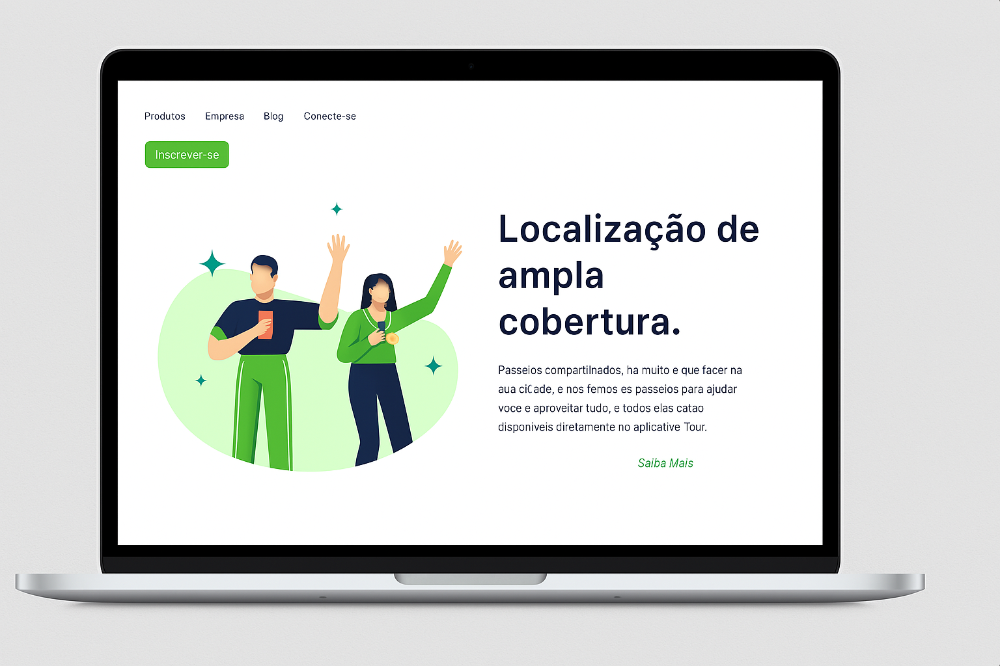
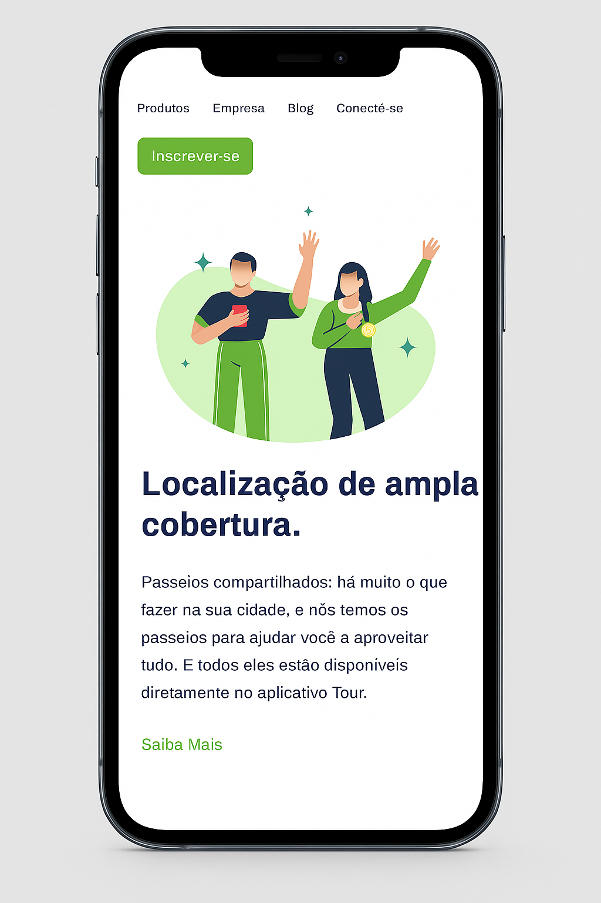

# 🌐 Projeto Responsivo: Site de Localização de Ampla Cobertura
<a href="https://alexandresilva78.github.io/projeto-responsivo-site-localizacao-de-ampla-cobertura/" target="_blank" alt='Projeto-Responsivo' >
  Acesse o site publicado.
</a>
<br>
<br>
<p align="center">
  
</p>

<p align="center">
  
</p>

Este projeto é um site responsivo criado com **HTML5** e **CSS3**, que simula uma página de apresentação para um serviço de passeios urbanos. O foco está na **experiência mobile**, com layout limpo, menus aéreos organizados e uma imagem ilustrativa simulando compras online.

🔗 **Repositório:**  
https://github.com/AlexandreSilva78/projeto-responsivo-site-localizacao-de-ampla-cobertura

---

## 📱 Responsividade

✅ O layout se adapta de forma fluida entre **notebooks e smartphones**, respeitando boas práticas de usabilidade:

- No modo **desktop**:
  - Menu horizontal no topo
  - Botão "Inscrever-se" ao lado do menu
  - Imagem à esquerda
  - Texto e botão "Saiba mais" à direita

- No modo **mobile** (até 780px):
  - Menu dividido em 2 linhas:  
    `Produtos` e `Empresa`  
    `Blog` e `Conecte-se`
  - Botão "Inscrever-se" centralizado abaixo do menu
  - Imagem centralizada
  - Texto e botão "Saiba mais" centralizados na vertical
<a href="https://alexandresilva78.github.io/projeto-responsivo-site-localizacao-de-ampla-cobertura/" target="_blank">
  <button>Abrir Projeto Online</button>
</a>
---

## 🧪 Tecnologias utilizadas

- HTML5 (estrutura semântica)
- CSS3 (estilização e responsividade com media queries)
- Google Fonts (Poppins)

---

## 🧱 Estrutura da Página

- **Header** com menu e botão de ação
- **Main** com imagem ilustrativa e bloco de texto
- **Section** com título, descrição e botão de navegação
- **Media Query** para adaptação abaixo de 780px

---

## 🧰 Como executar localmente

```bash
git clone https://github.com/AlexandreSilva78/projeto-responsivo-site-localizacao-de-ampla-cobertura.git
cd projeto-responsivo-site-localizacao-de-ampla-cobertura
